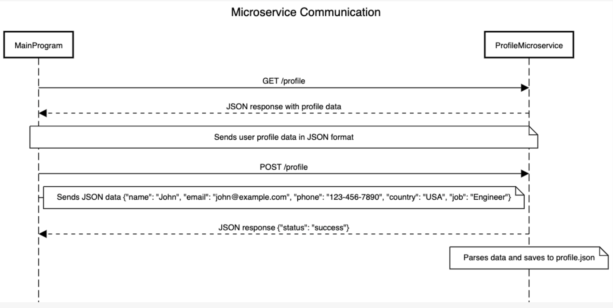

To request data from the Profile Microservice:

The program should send an HTTP GET request.

Example call:
Send a GET request to fetch profile data,

response = requests.get('http://localhost:5000/profile')
print(response.json())  
The output is the JSON profile data.

To receive data:
HTTP POST request

Uses parameters:

name (string): User's name
email (string): User's email
phone (string): User's phone number
country (string): User's country
job (string): User's job title

Example call, JSON data to update profile and send a POST request to update profile data:

data = {
    "name": "celia",
    "email": "celia@example.com",
    "phone": "123-456-7890",
    "country": "USA",
    "job": "plumber"
}
response = requests.post('http://localhost:5000/profile', json=data)
print(response.json()) 

3: UML Diagram

